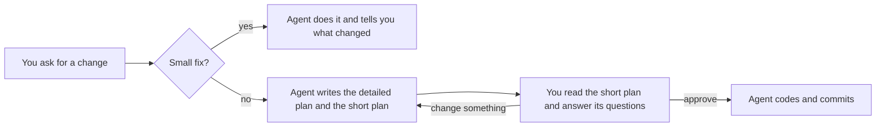

# ASD-STE100 for coding: plan-first

[](LICENSE) [](plan-first/skills/plan-first/SKILL.md) [](#install)

**English** · [简体中文](README.zh.md)

plan-first makes your AI coding agent (Claude Code, Codex, Cursor and others) hand you a plan you can actually read before it touches your code. The plan follows the sentence rules of ASD-STE100 Simplified Technical English, the standard Karpathy suggested models write toward: short sentences, active voice, one name for each thing. You read it, answer the few questions it asks, and approve it before the agent writes any code. Add it to `CLAUDE.md` or `AGENTS.md`, or install it as a Claude Code plugin. It works with Claude Code's plan mode too.

**Works with:** Claude Code (tested), plus Codex, Cursor, Gemini CLI and other tools that read `AGENTS.md` or `CLAUDE.md` (untested). If you've been looking for `CLAUDE.md` rules or an `AGENTS.md` template that makes your agent plan before it codes, this is one.

## Why

After coding with AI agents for a while, I realized reading had become my bottleneck. An agent can produce a plan of several thousand words, and usually only two or three things in it need my decision. The rest are details it could settle on its own. When a plan is that long, I end up approving it without really reading it.

In October 2026, Karpathy suggested asking models to write ["80% of the way to ASD-STE100"](https://x.com/karpathy/status/2105819303471976479) to make their output easier to read. I'd already been doing something similar, so I packaged it as plan-first and applied it to the plans I approve, which is where readability matters most when you code with an agent. To be clear, plan-first isn't affiliated with Karpathy or with ASD, and it doesn't claim ASD-STE100 compliance.

## Install

Pick one way. Installing both loads the rules twice.

**Always on (recommended).** Copy the rule files into your project and import them from `CLAUDE.md`:

```bash
mkdir -p docs/rules
curl -fsSLo docs/rules/plan-first.md https://raw.githubusercontent.com/AsherHou/asd-ste100-for-coding/main/plan-first/rules/en/plan-first.md
curl -fsSLo docs/rules/human-template.md https://raw.githubusercontent.com/AsherHou/asd-ste100-for-coding/main/plan-first/rules/en/human-template.md
echo "@docs/rules/plan-first.md" >> CLAUDE.md
```

For Chinese, replace `en` with `zh-CN` in the paths.

**Claude Code plugin:**

```
/plugin marketplace add AsherHou/asd-ste100-for-coding
/plugin install plan-first@asd-ste100-for-coding
```

The plugin kicks in automatically on development requests, and it uses the Chinese rules when you write in Chinese. You can also call it directly with `/plan-first:plan-first <task>`, or `/plan-first:plan-first-zh` for Chinese. It adds about 240 tokens to every session and about 6,000 each time it runs.

I haven't tested Codex, Cursor or Gemini CLI yet. Codex doesn't expand `@` imports, so paste the full text of `plan-first.md` into `AGENTS.md`. For Cursor, put it in `.cursor/rules/plan-first.mdc` with `alwaysApply: true`. Gemini CLI can import it from `GEMINI.md` with `@`.

## What it does



For a feature, refactor, dependency change or API change, the agent writes two files with the same name:

- `docs/plan/...` is the detailed plan, for the agent. Another agent could carry out the task from this file alone.
- `docs/human/...` is the short plan, for you. It covers what this does, what you need to decide, what you need to do yourself, and what it will affect.

The short plan only asks you about product trade-offs, anything that's hard to undo, and anything that costs money or touches your accounts. Naming, file layout and similar details are the agent's call, and it records them in its own plan. Each question says whether the choice can be undone and comes with a recommendation.

There's no "Risks" section. Instead, each risk is designed away, turned into a decision for you, or added to the agent's plan as a checkpoint where it stops and asks.

Here is part of a short plan an agent wrote in one of my tests. The task was adding Google sign-in to an app that already had email and password login:

```markdown
# Let people sign in to Tallybook with their Google account

> Status: Awaiting approval · v1 · 2026-10-07

## Decisions for you

1. **When should Tallybook connect Google to an existing account automatically?** (feature 2, can undo)
   - Recommended: Connect only when Tallybook has verified the address and Google controls it,
     as with Gmail or Google Workspace. About 9,000 accounts never verified their address,
     so a stranger could have created some of them.
   - Alternative: Connect every matching account automatically.
```

## Before and after

Same task: adding Google sign-in, which I chose as the example before running the test. The plain agent's plan is about 1,100 words and plan-first's short plan about 1,000, so the real difference isn't length. It's what fills them.

**A plain agent's plan opens like this:**

````markdown
# Plan: Sign in with Google

I haven't changed anything yet. Below is the plan, the decisions I need from you, and the setup work only you can do.

## Decisions I need from you

1. **How to handle existing accounts whose email was never verified (about 9,000).** This is the main security risk. Someone could sign up with a victim's address and a password they choose, without verifying it. If we then merge the victim's Google login into that account automatically, the attacker's password keeps working and they can read the victim's invoices.
   **My recommendation:** link automatically only when Google reports `email_verified: true`. If the Tallybook account was never verified, still link it, but in the same transaction:
   - mark the account verified,
   - remove the existing password,
   - end all of that user's existing sessions,
   - email them a notice.

   That is equivalent to a password reset, which Google's verified email justifies. The cost is that a legitimate user who never clicked the verification link loses their password and must use Google or "forgot password". The alternative is to refuse to link and send these users through password reset first. That is safer but adds friction.
2. **Preview deploys.** Google doesn't allow wildcard redirect URIs, so `pr-<n>.preview…` can't use Google sign-in. I'd keep the feature flag off on previews and test on local and staging. Is that acceptable?
3. **Which Google Cloud project to use.** I'd reuse `tallybook-prod` for the production client and create separate OAuth clients for staging and local, ideally in a separate non-prod project. While you're in that project, it's worth checking for API keys left over from the autocomplete experiment.

## Work only you (or counsel) can do

These block a production launch, not development:
- **Google Cloud console** (you're the only Owner). Set up:
  - an "External" OAuth consent screen with app name, logo, support email, the authorized domain `tallybook.example.com`, and links to the homepage and privacy policy;
  - scopes `openid email profile` only, which are non-sensitive, so no security review is needed;
  - publishing status "In production". In testing mode, only listed test users can sign in;
  - one Web OAuth client per environment, with these redirect URIs:
    - `http://localhost:3000/auth/google/callback`
    - `https://staging.tallybook.example.com/auth/google/callback`
    - `https://app.tallybook.example.com/auth/google/callback`
…
````

**plan-first's short plan opens like this:**

````markdown
# Let people sign in to Tallybook with their Google account

> Status: Awaiting approval · v1 · 2026-10-07
>
> Plan doc for the agent: [../plan/2026-10-07-google-sign-in.md](../plan/2026-10-07-google-sign-in.md)

## What this does

1. **Add Google sign-in and signup**
   - Purpose: People can sign in or create an account with Google instead of a password. Without this, every user must create and remember a Tallybook password.
   - When done:
     - The login and signup pages show a "Sign in with Google" button when the feature is on (your requirement).
     - A new person who uses the button gets a new account and is logged in. Tallybook marks their email address as verified.
     - A person who already connected Google gets the same account each time they use the button.
     - All automated checks pass, and I open a pull request for review.

2. **Connect Google to existing accounts** (depends on feature 1)
   - Purpose: Current users can use Google with the account they already have (your requirement). Without care, a stranger could take over an account through a matching email address.
   - When done:
     - A user whose email address both Tallybook and Google have confirmed is connected automatically and logged in.
     - Other users with a matching address see a message. It tells them to log in with their password and connect Google on the Security page.
     - On the Security page, a logged-in user can connect or disconnect Google.
     - Tallybook emails the user each time Google is connected to their account.
…
````

The plain agent does ask good questions, but they sit among `email_verified`, redirect URIs, environment variables and migration details. plan-first keeps that material in the agent's own plan, so the short plan reads as a summary of what will happen. Across the whole test, here is how much inline code (identifiers, commands, config keys) the approver's document had per 100 words, averaged over the 10 tasks that need decisions:

| | Plain agent | 80%-STE prompt | andrej-karpathy-skills | Plan + short summary | plan-first |
|---|---|---|---|---|---|
| English | 4.3 | 4.3 | 4.3 | 3.3 | **0.2** |
| Chinese | 2.7 | – | – | 1.2 | **0.16** |

That's about 95% less technical noise than a plain agent. I measured this after the test, and `benchmark/explore.py` reproduces it. The Chinese run didn't include the 80%-STE and andrej-karpathy-skills setups.

## What to expect

- For features, refactors, dependency changes and API changes, the agent writes both plans and stops until you approve.
- Bug fixes, typo and formatting fixes, and small changes where you already gave the exact value skip the plan.
- The project needs to be a git repository. After carrying out a plan, the agent commits only the files in that plan's change list. If your project has its own git conventions, those win.
- In Claude Code plan mode, the agent puts the short plan in the first half of the plan file and the detailed plan in the second half. After you approve, it saves them to `docs/human/` and `docs/plan/`.

## Does it work?

I compared five setups on 13 synthetic coding tasks, all using Claude Opus 5.5 as the coding agent. The numbers below are averages from the English run, over the 10 tasks where a person has to make a decision:

| | plan-first | Plain agent | 80%-STE prompt | andrej-karpathy-skills | Plan + short summary |
|---|---|---|---|---|---|
| Decisions you are asked to make, per plan | **3.4** | 4.9 | 5.4 | 5.4 | 3.6 |
| Inline code (identifiers, commands, config keys) per 100 words | **0.2** | 4.3 | 4.3 | 4.3 | 3.3 |
| Trivial questions, per plan | **0** | 0.7 | 0.2 | 0.3 | **0** |
| Decisions marked "can undo" or "hard to undo" | **51%** | 15% | 22% | 20% | 18% |
| Out-of-scope work slipped into the plan | **0** | 0.5 | 0.1 | 0.1 | 0.2 |

plan-first asks the fewest questions because it settles the low-risk choices itself and states them in the plan. Because of that, a reader looking for the decisions a plan needs from a person finds fewer of them: 70% in plan-first plans, against 87% in a plain agent's plans (after we fixed a quote-matching bug). The short plan runs about 1,000 words, so it isn't shorter than a plain agent's plan, and plan-first uses about 5 times as many output tokens as a plain agent.

I added the inline-code row after the test. The readers and graders in this test were language models, not people. The method, every output and the scripts are in [benchmark/](benchmark/README.md). For side-by-side outputs of one task, see [benchmark/examples/](benchmark/examples/t1-en.md).

## FAQ

**How is this different from Karpathy's tip?**
His tip is about making a model's explanations easier to read. plan-first uses the same sentence rules only in the plan you approve, and adds a fixed structure and an approval step.

**How is it different from andrej-karpathy-skills?**
That's a `CLAUDE.md` by multica-ai about coding habits like "think before coding" and "surgical changes". It doesn't say how a plan should look. You can use both.

**Why not strict ASD-STE100?**
Strict STE allows only about 900 approved words. In an informal test, code explanations written in strict STE left out facts. plan-first borrows only the sentence rules and keeps every detail in the agent's plan.

**Where do the rules come from?**
Each rule and its sources are in [docs/theory-map.md](docs/theory-map.md). For example: fixed headings make a document easy to scan, people learn to ignore warnings that are always there, and you can decide quickly when a choice can be undone but should slow down when it can't.

## License

MIT
