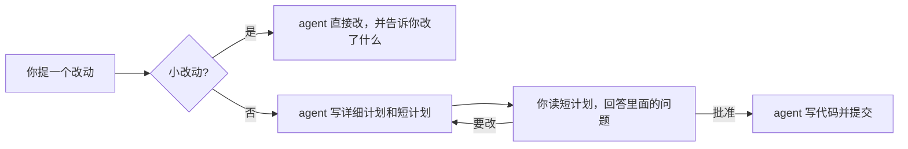

# ASD-STE100 for coding：plan-first

[](LICENSE) [](plan-first/skills/plan-first/SKILL.md) [](#安装)

[English](README.md) · **简体中文**

让 AI 编程助手（Claude Code、Codex、Cursor 等）动手改代码之前，先交给你一份读得完的计划。计划借鉴 ASD-STE100 简化技术英语（Simplified Technical English，Karpathy 推荐过的那套写法）：句子短，用主动语态，同一个东西只用一个名字。你看完、拍板，它才开始写代码。可以写进 `CLAUDE.md` 或 `AGENTS.md`，也可以装成 Claude Code 插件，开着计划模式也能用。

**适用工具**：Claude Code（已测试）；Codex、Cursor、Gemini CLI 等读 `AGENTS.md` 或 `CLAUDE.md` 的工具（未测试）。如果你在找一份能直接用的 CLAUDE.md 规则、AI 编程规则模板，或者想让 agent 先计划后编码，可以直接拿去用。

## 为什么做这个

用 AI 写代码久了，最累的反而是读。agent 一次能写出几千字的计划，真正要我拍板的往往就两三件事，剩下的都是它自己能定的细节。计划太长读不完，最后就成了闭着眼点"同意"。

2026 年 10 月，Karpathy 发帖说，让模型照着 ["80% 的 ASD-STE100"](https://x.com/karpathy/status/2105819303471976479) 来写，读起来会轻松很多。我自己一直在用差不多的做法，就顺手整理成了 plan-first，只管写代码这一件事。先说清楚：plan-first 跟 Karpathy、ASD 都没关系，也没说自己符合 ASD-STE100 标准。

## 安装

两种方式选一种就行，都装会把规则加载两遍。

**一直生效（推荐）**：把规则文件放进项目，在 `CLAUDE.md` 里引用。

```bash
mkdir -p docs/rules
curl -fsSLo docs/rules/plan-first.md https://raw.githubusercontent.com/AsherHou/asd-ste100-for-coding/main/plan-first/rules/zh-CN/plan-first.md
curl -fsSLo docs/rules/human-template.md https://raw.githubusercontent.com/AsherHou/asd-ste100-for-coding/main/plan-first/rules/zh-CN/human-template.md
echo "@docs/rules/plan-first.md" >> CLAUDE.md
```

英文项目把路径里的 `zh-CN` 换成 `en`。

**Claude Code 插件**：

```
/plugin marketplace add AsherHou/asd-ste100-for-coding
/plugin install plan-first@asd-ste100-for-coding
```

装好后，开发类的请求会自动触发；你用中文提需求，它就用中文版规则。也可以手动调用：中文版是 `/plan-first:plan-first-zh <任务>`，英文版是 `/plan-first:plan-first <任务>`。插件常驻约 240 token，每触发一次约 6000 token。

Codex、Cursor、Gemini CLI 我还没测过，装法如下：Codex 不支持 `@` 引用，直接把 `plan-first.md` 全文贴进 `AGENTS.md`；Cursor 放到 `.cursor/rules/plan-first.mdc`，设上 `alwaysApply: true`；Gemini CLI 在 `GEMINI.md` 里用 `@` 引用就行。

## 它做什么



遇到新功能、重构、改依赖、改接口这类任务，agent 会写两份同名文件：

- `docs/plan/` 下是给 agent 自己看的详细计划。细节都在这里，换一个 agent 也能照着做完。
- `docs/human/` 下是给你看的短计划，只讲四件事：这次做什么，要你拍板什么，要你亲手做什么，会影响到哪里。

短计划只拿三类事问你：产品上的取舍，撤不回的操作，花钱或动你账号的事。命名、目录这类小事，agent 自己定，记在它那份计划里。每件要你定的事都会注明能不能撤回，还会给出它推荐的选项。

短计划里不单列"风险"。能换个做法绕开的就绕开；绕不开的，要么变成一个问题交给你定，要么写进 agent 的计划，真碰上了再停下来问你。

下面是测试时 agent 实际写出来的一份短计划（节选），任务是给一个已经支持邮箱密码登录的应用加 Google 登录：

```markdown
# 在登录页和注册页加上"使用 Google 登录"

> 状态：待批准 · v1 · 2026-10-07

## 需要你决定的事

1. **同一邮箱已有账号时，用 Google 登录要自动关联吗？**（功能 2，能回退）
   - 推荐：只在 Google 能担保这个邮箱时自动关联。担保指 gmail.com 邮箱，
     或由公司 Google Workspace 管理的邮箱。……
   - 备选 A：只要 Google 标记邮箱已验证，就自动关联。用户更省事，但企业域名邮箱的风险更高。
   - 备选 B：一律不自动关联，都要先用密码登录再手动关联。最安全，但每个老用户都要多走一步。
```

## 前后对比

同一个任务：给应用加 Google 登录。这个任务是我在测试之前就选定的样例。普通 agent 的计划约 2200 字，plan-first 的短计划约 1500 字。短一些，但更大的差别在里面写了什么。

**普通 agent 的计划，开头是这样的：**

````markdown
# 方案：Tallybook 接入“使用 Google 登录”

按你的要求，这次只出方案，不改任何文件。下面先列出需要你拍板的决策和外部依赖，然后是技术设计、改动清单和上线步骤。

## 一、需要先确定的事项

**1. 账号关联规则（最关键）**

我建议：**只用 Google 的 `sub` 识别用户，不靠邮箱自动合并账号。** 如果 Google 返回的邮箱已经对应一个现有账号，必须先用该账号的密码登录确认，才能完成关联。

原因：现在约 9,000 个账号从未验证过邮箱。如果按邮箱自动合并，会出现“预先劫持”：

1. 攻击者先用受害者的邮箱和自己设的密码注册（不需要验证）。
2. 受害者后来用 Google 登录，被自动并入这个账号。
3. 攻击者仍然可以用密码登录，看到受害者的发票、客户和银行导出文件。

要求密码确认就能堵住这个口子。真正的邮箱主人如果不知道密码，可以走“忘记密码”。重置流程本身证明了邮箱所有权，前提是重置会清掉该用户的所有旧会话（见第三节第 6 条）。

代价：已有密码账号的用户第一次用 Google 登录时多一步输密码。如果你更看重顺滑，可以只对“本地已验证且 Google 返回 `email_verified=true`”的账号自动关联。但我不推荐用于自定义企业域名的邮箱，因为域名或邮箱可能易主。

**2. 需要创始人亲自完成的工作（工程师没有控制台权限）**

- 在 `tallybook-prod` 中配置 OAuth 同意屏幕，包括应用名称、首页、隐私政策 URL 和授权域名 `tallybook.example.com`。范围只用 `openid email profile`，不属于敏感 scope，但上传 logo 等品牌信息可能需要 Google 审核。
- 建两个 OAuth 客户端（Web 类型）：
  - **生产**：回调为 `https://app.tallybook.example.com/auth/google/callback`
  - **非生产**：回调为 staging 地址和 `http://localhost:3000/auth/google/callback`。这个客户端保持 Testing 状态，并加入测试用户。
- 把 `GOOGLE_CLIENT_ID` 和 `GOOGLE_CLIENT_SECRET` 写入托管平台的 staging 和生产环境设置，非生产那套同时放进密码管理器保险库。
…
````

**plan-first 的短计划，开头是这样的：**

````markdown
# 在登录页和注册页加上"使用 Google 登录"

> 状态：待批准 · v1 · 2026-10-07
>
> agent 执行版：[../plan/2026-10-07-google-login.md](../plan/2026-10-07-google-login.md)

## 这次要做什么

1. **新增 Google 登录和注册**
   - 目的：用户可以用 Google 账号登录，不用再记一个密码。这是你的要求。
   - 做完后：
     - 登录页和注册页会出现"使用 Google 登录"按钮。这是你的要求。
     - 没有账号的人点这个按钮，Tallybook 会直接为对方创建账号。
     - 只用 Google 注册的账号没有密码。需要密码时，用户可以用"忘记密码"邮件设置一个。
     - 按钮由一个功能开关控制。功能开关是一项环境设置，打开后按钮才会出现。
     - 在 staging 上，你可以用自己的 Google 账号登录成功。
2. **兼容已有的邮箱密码账号**（依赖功能 1）
   - 目的：已有账号的人用 Google 登录时，应该进入原来的账号。否则用户会多出一个空账号。这是你的要求。
   - 做完后：
     - "关联"指把一个 Google 账号和一个 Tallybook 账号绑在一起。关联后，用户用 Google 登录会进入这个账号。
     - 邮箱相同时，Tallybook 按"需要你决定的事"第 1 项的规则决定是否自动关联。
     - 不能自动关联时，页面会请用户先用密码登录，再去账号安全页关联。
…
````

普通 agent 其实也问到了该问的事，只是夹在 `sub`、`email_verified`、回调地址、环境变量这些技术细节中间。plan-first 把这些都留在 agent 自己的计划里，短计划读起来就是"这一轮要做什么"。下面是整个测试里，批准人要读的文档每百词有多少处行内代码（变量名、命令、配置项），取 10 个需要拍板的任务的平均值：

| | 普通 agent | 80% STE 提示词 | andrej-karpathy-skills | 计划 + 短摘要 | plan-first |
|---|---|---|---|---|---|
| 英文 | 4.3 | 4.3 | 4.3 | 3.3 | **0.2** |
| 中文 | 2.7 | – | – | 1.2 | **0.16** |

比普通 agent 少了约 95% 的技术噪音。这个指标是测试结束后补测的，`benchmark/explore.py` 可以复现。中文测试没有跑 80% STE 和 andrej-karpathy-skills 两组。

## 装上之后会发生什么

- 新功能、重构、改依赖、改接口这类任务，agent 会先写好两份计划，然后停下来等你批准。
- 修 bug、改错别字、改格式，或者你已经说清楚具体改法的小改动，它直接做，不出计划。
- 项目得用 git 管理。计划执行完，它只提交这次改动清单里列出的文件。如果项目有自己的 git 约定，以项目的为准。
- 开着 Claude Code 计划模式时，它会把短计划放在计划文件的前半部分，详细计划放在后半部分。你批准后，再分别存进 `docs/human/` 和 `docs/plan/`。

## 效果怎么样

我用 13 个虚构的编码任务做了对比，写代码的都是 Claude Opus 5.5。下表是英文测试中 10 个需要人拍板的任务的平均值：

| | plan-first | 普通 agent | 80% STE 提示词 | andrej-karpathy-skills | 计划 + 短摘要 |
|---|---|---|---|---|---|
| 每份计划问你几个决定 | **3.4** | 4.9 | 5.4 | 5.4 | 3.6 |
| 每百词的行内代码（变量名、命令、配置项） | **0.2** | 4.3 | 4.3 | 4.3 | 3.3 |
| 每份计划的琐碎提问 | **0** | 0.7 | 0.2 | 0.3 | **0** |
| 标明能否撤回的决定 | **51%** | 15% | 22% | 20% | 18% |
| 夹带的范围外工作 | **0** | 0.5 | 0.1 | 0.1 | 0.2 |

plan-first 问的事最少，因为低风险的选择它自己定了，写在了计划里。当然也有代价：让读者从文档里找出"我要决定什么"，在 plan-first 的文档里只找到 70%，在普通 agent 的计划里能找到 87%（修正引文匹配后的数字）。短计划也不比普通计划短，平均有 1000 词左右；输出 token 大约是普通 agent 的 5 倍。

行内代码这一行是测试结束后补测的。参与评测的读者和评分员都是语言模型，不是真人。方法、全部输出和脚本都在 [benchmark/](benchmark/README.md)，同一个任务各组的完整输出可以看 [benchmark/examples/](benchmark/examples/t1-zh-CN.md)。

## 常见问题

**和 Karpathy 的建议有什么区别？**
他说的是让模型解释问题时写得简单些。plan-first 只在你要批准的那份计划里这么写，另外加了固定结构和一个批准环节。

**和 andrej-karpathy-skills 有什么区别？**
那是 multica-ai 整理的一份 `CLAUDE.md`，讲"先想后写""改动要精准"这类编码习惯，没规定计划怎么写。两个可以一起用。

**为什么不直接用严格的 ASD-STE100？**
严格的 STE 只允许用 900 个左右的词。有人测过，拿它解释代码会漏掉不少信息。plan-first 只借它的句子写法，细节全留在给 agent 的那份计划里。

**每条规则的依据在哪？**
在 [docs/theory-map.zh-CN.md](docs/theory-map.zh-CN.md)。比如：固定标题方便扫读；一直挂着的警告，看久了就没人理了；能撤回的决定可以快点定，撤不回的要慢慢想。

## 许可证

MIT
